# Full Attack Lifecycle Investigation - Blue Team Report

This is a project from the Technion Cyber Defense & Offense Program. The assignment was to run a realistic attack against a Windows VM, start to finish, and then go back and reconstruct the whole thing using nothing but log evidence — no notes, no memory of what I'd done, just Sysmon, Windows Event Logs, and Splunk.

I built the attack myself: phishing lure, payload, a Meterpreter shell, credential dumping, a scheduled task for persistence, and a simulated exfiltration. Then I sat down as if I were the analyst who'd just been handed this incident cold, and worked backward through the logs until the whole story matched what I actually did.

The original lab VMs are long gone at this point (it's been about a year), so what's below is written from the incident report I submitted at the time, plus the screenshots I captured along the way. The full original report is also in this repo if you want the more detailed academic version — see the link at the bottom.

I'm currently building a follow-up to this, a home lab using Sysmon and Atomic Red Team to test detections against specific MITRE ATT&CK techniques, partly because writing this report is what convinced me EDR was the missing piece (more on that below).

---

## Setup

Attacker side was Kali Linux with Metasploit. Victim was a Windows VM with Defender turned off on purpose, otherwise the payload wouldn't have run. I installed Sysmon with the SwiftOnSecurity config and turned on advanced audit logging through Group Policy, then fed everything into Splunk so I'd have one place to search across all of it.

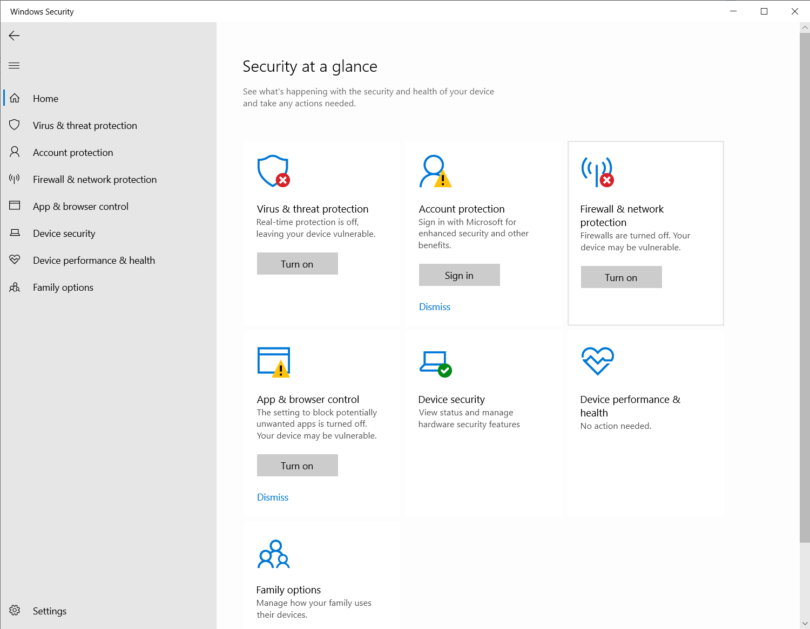
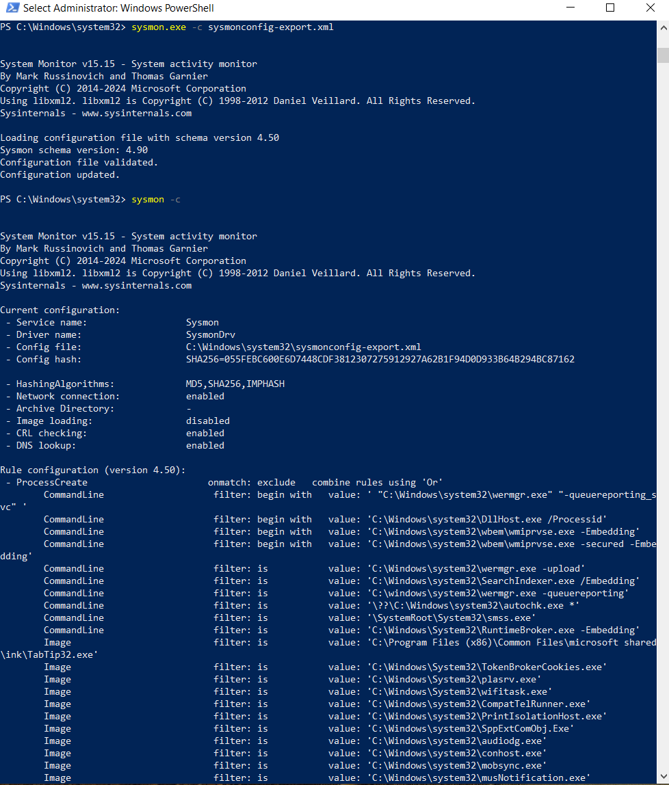
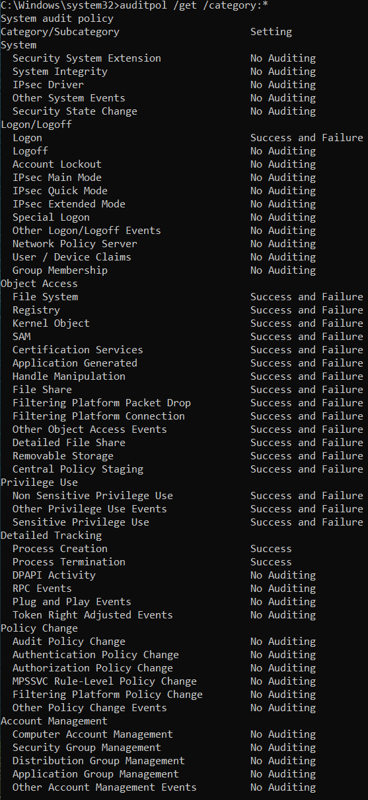

---

## What happened, step by step

I mapped each stage to MITRE ATT&CK afterward, since that's the vocabulary this kind of write-up should speak in.

| Phase | What I did | Tool | ATT&CK Technique |
|---|---|---|---|
| Initial Access | Phishing email pointing to a malicious executable | Simulated email | T1566 – Phishing |
| Execution | Victim downloads and runs `SecurityApproval.exe` | msfvenom payload | T1204 – User Execution |
| Command & Control | Reverse shell back to my attacker box on port 5555 | Metasploit / Meterpreter | T1071 – Application Layer Protocol |
| Credential Access | Dumped credentials straight from memory via Meterpreter's `kiwi` module (no separate `mimikatz.exe` process) | Mimikatz | T1003.001 – LSASS Memory |
| Persistence | Scheduled task to re-run a second payload (`WinHelper.exe`) at logon | `schtasks.exe` | T1053.005 – Scheduled Task |
| Defense Evasion | Stuck to built-in tools like PowerShell and `cmd.exe` rather than custom binaries | Living-off-the-land | T1218 – System Binary Proxy Execution |
| Exfiltration | Simulated file transfer out via PowerShell | PowerShell | T1041 – Exfiltration Over C2 Channel |

### Getting in

Sent myself a phishing email with a link, hosted the payload off a quick Python HTTP server, and let the victim VM download and run it.

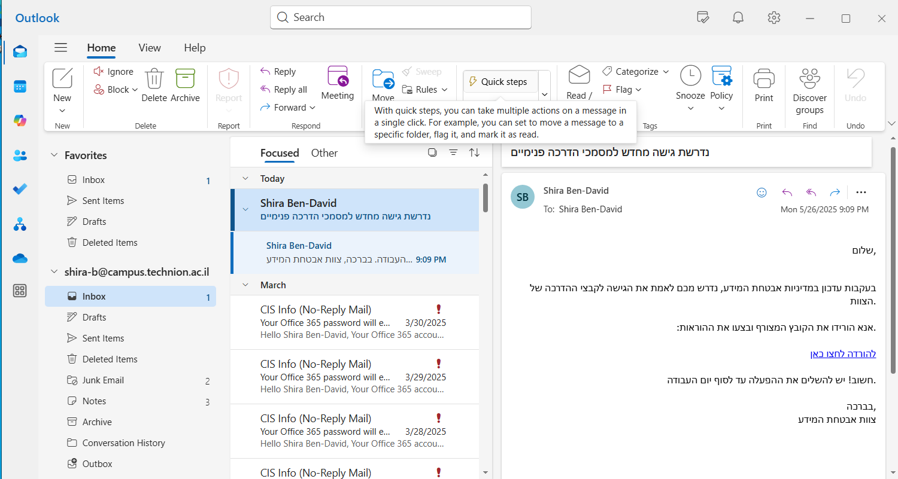
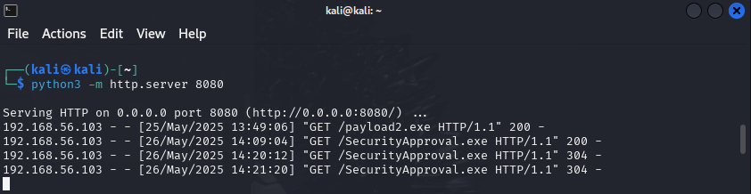
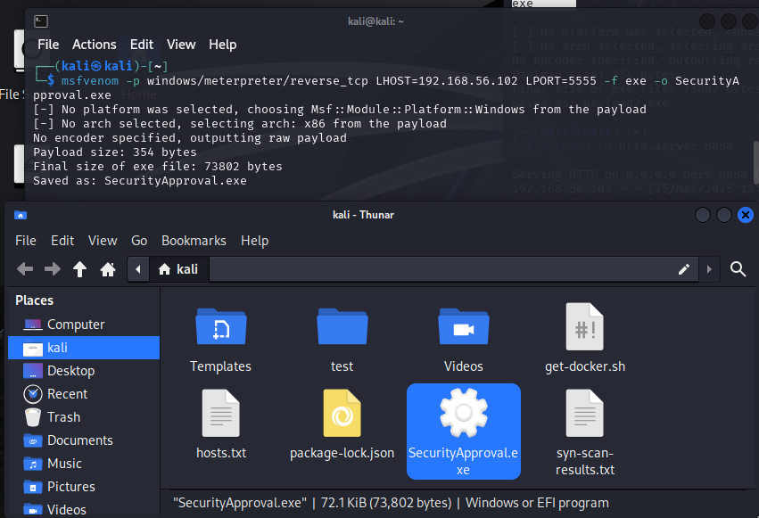
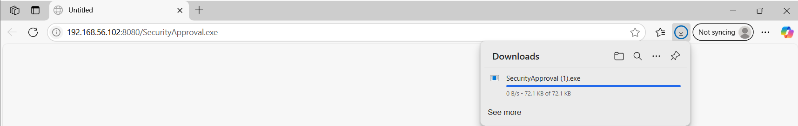

### Getting a shell

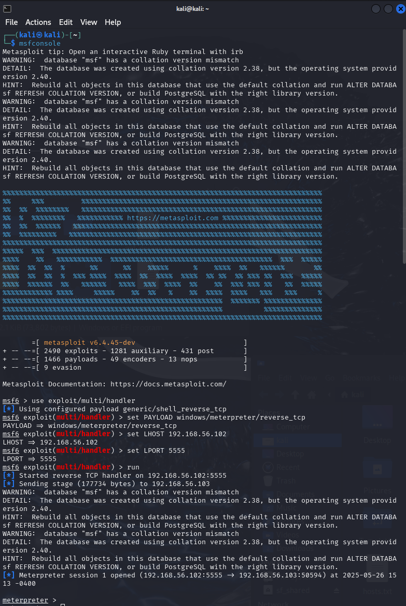
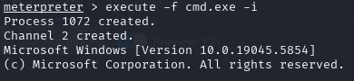

### Escalating and grabbing credentials

This was the part I found most interesting to investigate afterward, because dumping credentials via Meterpreter's `kiwi` extension doesn't drop a `mimikatz.exe` file anywhere. It all happens in memory, which is exactly why it's hard to catch with anything signature-based.

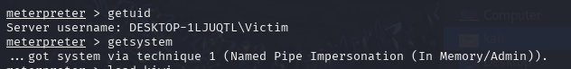
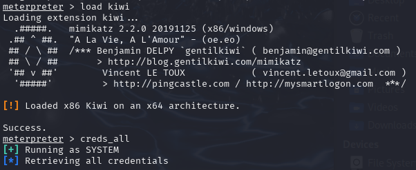

### Sticking around

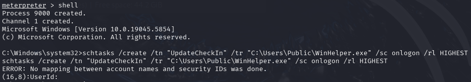
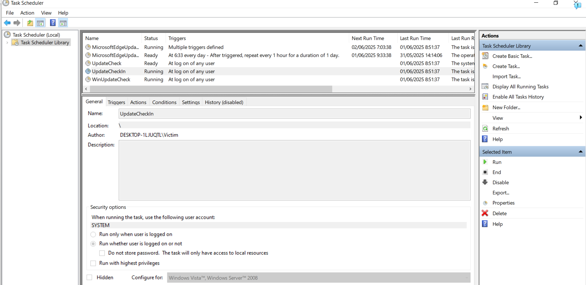

### Getting data out

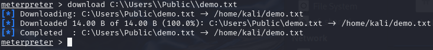

---

## How I actually found all of it

This is the part that mattered most for the exercise: everything above, I reconstructed cold from logs, without relying on what I remembered doing.

A few Sysmon event IDs did most of the work:

| Event ID | Source | What it showed me |
|---|---|---|
| 1 | Sysmon | Process creation — `powershell.exe`, `cmd.exe`, and the payload launching |
| 3 | Sysmon | Network connections — the reverse shell to `192.168.56.102:5555`, and the payload download over port 8080 |
| 8 | Sysmon | `CreateRemoteThread` — `csrss.exe` injecting into `cmd.exe`, which is what tipped me off to the in-memory credential dumping |
| 11 | Sysmon | File creation — `SecurityApproval.exe` landing in Downloads via Edge |
| 13 | Sysmon | Registry change for the `Run` key persistence |
| 4698 | Windows Security | The scheduled task being created |

I pulled logs from three places and cross-referenced them: Sysmon for the endpoint-level detail, native Windows Event Logs (converted to CSV with EvtxECmd so I could actually search them), and Splunk to tie it all together in one place.

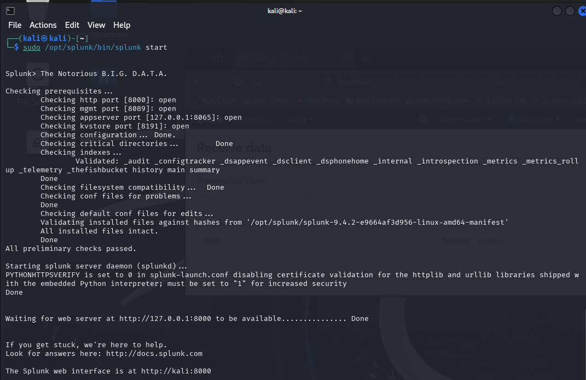
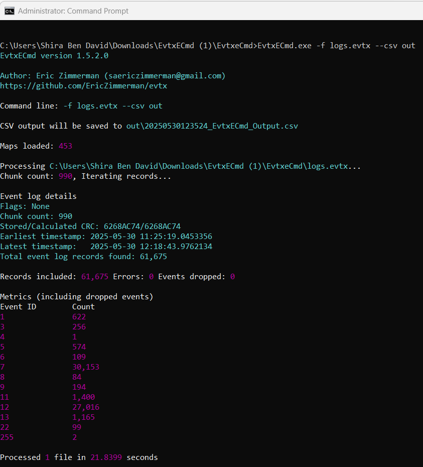
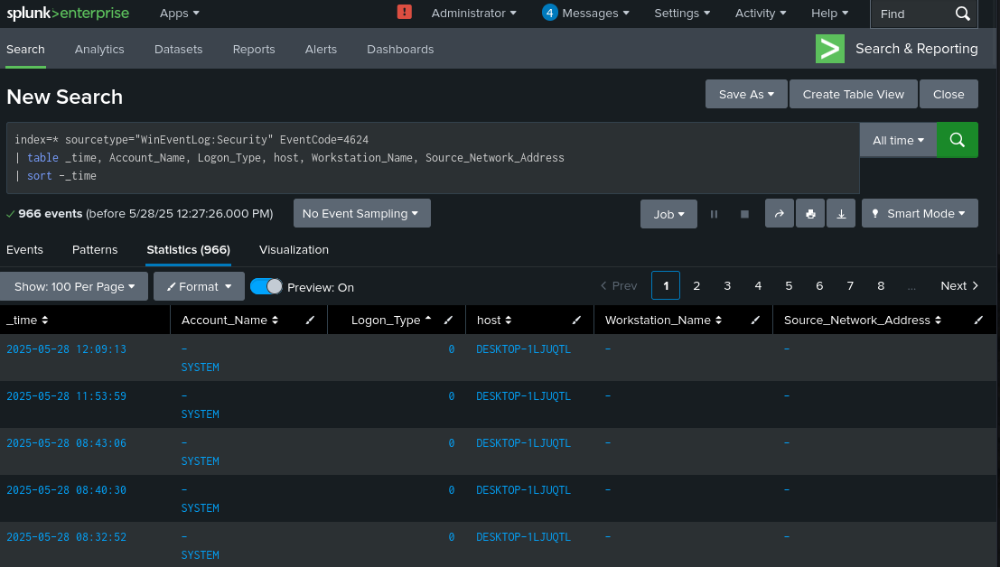
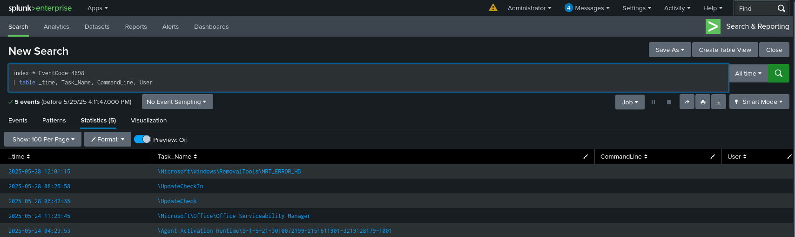
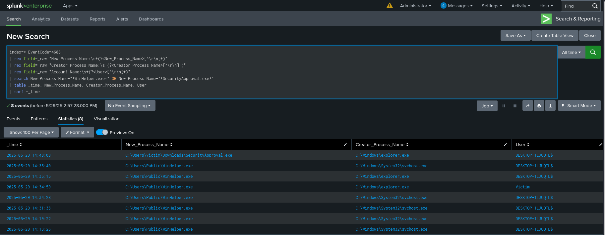
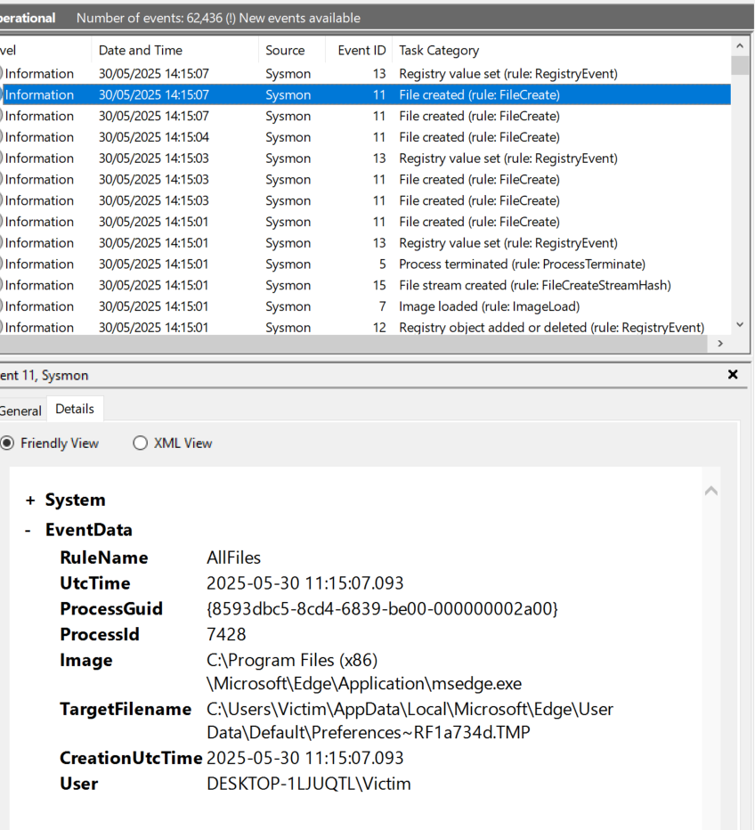

---

## IOCs

- IP: `192.168.56.102` — attacker box, both payload host and C2
- Ports: `8080` (payload delivery), `5555` (C2 channel)
- File: `SecurityApproval.exe` in `C:\Users\Victim\Downloads\`
- File: `WinHelper.exe` in `C:\Users\Public\`
- Registry: `HKLM\...\Run` key modified for persistence
- Process chain: `csrss.exe` → `cmd.exe` (the injection I mentioned above)

## IOAs

- An unsigned executable run straight out of Downloads
- Outbound traffic to a port nobody normally uses (5555)
- `csrss.exe` spawning threads inside `cmd.exe`
- Autorun registry key touched right after the initial execution

---

## What I'd fix

A few gaps I'd close if I ran this again:

- Turn on Sysmon Event IDs 7 and 10 (image load and process access) — I didn't have full visibility into DLL loading or process injection, and it showed.
- Real-time alerting on writes to the `Run` key instead of only catching it after the fact.
- The big one: an actual EDR platform. I ran this whole exercise with Defender switched off, which was necessary for the payload to work, but it's also exactly the point. Signature-based AV was never going to catch in-memory credential access or living-off-the-land behavior like this. This is the recommendation that's shaped what I'm working on now.
- Application control to stop unsigned executables running from user-writable folders.
- PowerShell Script Block and Module Logging, for full command-line visibility instead of just process names.
- Standard user accounts without local admin, so a successful foothold doesn't automatically mean full control.
- Feeding these IOCs into actual SIEM detection rules and re-testing them periodically, ideally with something like Atomic Red Team.

---

## Where this led

The EDR recommendation above turned into an actual project: I'm building a home lab with Sysmon and Atomic Red Team to test detection against specific MITRE ATT&CK techniques, and studying Microsoft Defender for Endpoint hands-on to close the exact gap this report identified. I'm also working through CIS Benchmarks to tighten up configuration hardening on the lab machines.

---

**Full original report:** [full-report.docx](full-report.docx) — the complete academic write-up this project is based on.

*Technion Cyber Defense & Offense Implementation Program, Blue Team track. Tools: Kali Linux, Metasploit, Mimikatz, Sysmon, Splunk Enterprise, EvtxECmd.*
